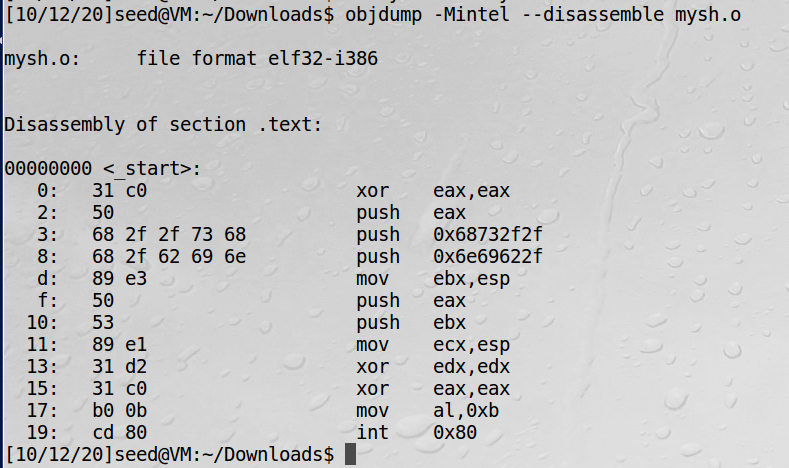
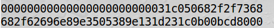
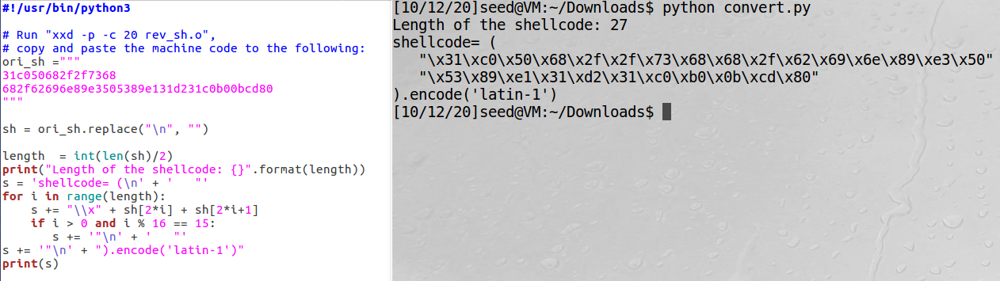
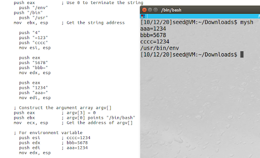
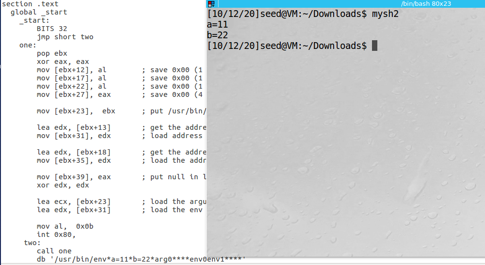

# Shellcode-Development-Lab
Shellcode is widely used in many attacks that involve code injection. Though shellcodes are easily available on the internet, there occur situations when certain specifications and requirements need to be fulfilled. This is when shellcode needs to be developed by the attacker.

## Task 1: Writing Shellcode

### Task 1.a: The Entire Process
- [mysh.s](mysh.s) is the shellcode that can be used to load **/bin/sh** shell. 
- **eax** is a 32-bit general-purpose register with two common uses: to store the return value of a function and as a special register for certain calculations.
- The **text** section is used for keeping the actual code. This section must begin with the declaration `global _start`, which tells the kernel where the program execution begins. Its syntax is:
```
section.text
   global _start
_start:
```
- C library executes commands inside `main()` when the program runs, but actually it has the `_start` label inside itself. The code at `_start` does some initialization, then it calls `main`, then it does some clean up, then it issues the system call for exit. So the coder just needs to implement main.
- But in assembly, `_start` needs to be defined by the programmer (one may choose to call the main function directly from the _start and implement the code there)
- **eax** stores *0* to terminate the string; **ebx** stores the string address which holds */bin/sh*; **ecx** stores the *address of the arguments*; and **edx** stores the *address of the environment variables* in this program. Finally execve() is invoked to execute the shell (its parameters are taken from ecx and edx for arguments and environment variables respectively).
- `nasm -f elf32 mysh.s -o mysh.o` this command can be used to compile the [mysh.s](mysh.s) program. **nasm** is used to compile the assembly program. `-f` specifies the format of the compiled file which is elf32 (32-bit ELF). 
> The Netwide Assembler (NASM) is an assembler and disassembler for the Intel x86 architecture. It can be used to write 16-bit, 32-bit (IA-32) and 64-bit (x86-64) programs. NASM is considered to be one of the most popular assemblers for Linux. 
- To generate the executable binary, the linker program `ld` can be run: `ld mysh.o -o mysh`
- On running mysh in the linux terminal, it gives /bin/sh shell.
- During the attack, only machine code is required rather than the whole executable file. Technically, only the machine code is the shellcode. One way to extract the machine code from the executable file is by using objdump command to disassemble the executable or object file. By default, objdump uses the `AT&T` mode. To get the assembly code in intel mode, `-Mintel` can be added as an option: `objdump -Mintel --disassemble mysh.o`
> The 2nd column in the result is the machine code. It starts with 31 c0 50 68 … and ends at b0 0b cd 80.


- `xxd -p -c 20 mysh.o` xxd can also be used to print the content of the binary file. And according to the result, `31c050682f2f7368682f62696e89e3505389e131d231c0b00bcd80` is the machine code.



- Shellcode needs to be included in the attacking code such as python or c program. To convert the above machine code into an array, convert.py can be used. This machine code can be set as the value of `ori_sh` variable and then the program can be run to get the machine code in array form.



### Task 1.b. Eliminating Zeros from the Code
- Shellcode is widely used in buffer-overflow attacks. In many cases, the vulnerabilities are caused by string copy, such as the `strcpy()` function. For these string copy functions, zero is considered as the end of the string. Therefore, if the shellcode has a zero in the middle, string copy will not be able to copy anything after the zero from this shellcode to the target buffer, so the attack would not succeed.
- Here are some tips to remove the 0s from the machine code:
  1. To assign 0 to eax, `xor eax eax` can be done.
  2. To store e 0x00000099 to eax, first eax can be set to 0 and then assigned 1 byte number 0x99 to the **al** register.
  3. Another way is to use *shift*. For e.g. to store 0x007A7978 (“xyz\0”) in the register, first 0x237A7978 is assigned to ebx. The ASCII values for x, y, z, and # are 0x78, 0x79, 0x7a, 0x23, respectively. Because most Intel CPUs use the little-Endian byte order, the least significant byte is the one stored at the lower address. After assigning the number to ebx, the register can be left shifted by 8 bits pushing out the most significant bit, 0x23 which is # and then on right shifting by 8 bits, ebx will contain 0x007A7978.
- In the line no. 7 of [mysh.s](mysh.s), `/sh` is to be pushed but this brings a 0 at the most significant bit, so `//sh` is used. For OS, `//` is equivalent to `/`.
- To execute the */bin/bash* shell using the shellcode, instead of push `//sh`, 2 lines can be added:
```
push “h”
push “/bas”
```
- This executes the bash shell. Because one byte push uses the machine code `6a` instead of `68`, it does not append 0 (for `push “h”`)

### Task 1.c. Providing Arguments for System Calls
- In [mysh.s](mysh.s), line no. 12 and 13 are used to construct the arguments, **arg[]** for the `execve()` System call.
- Since the command is /bin/sh, without any command-line arguments, the argv[] array only contains two elements: the first one is a pointer to the command string, and the second one is zero.
- To execute `/bin/sh -c ls -la` using the shellcode, extra 2 arguments; for `-c` and for `ls -la` needs to be added in the argv array such that the argument coincides as below
```
argv[3] = 0 
argv[2] = "ls -la" 
argv[1] = "-c" 
argv[0] = "/bin/sh"
```
- For that, after line no. 9 in [mysh.s](mysh.s), the following code can be added. 
```
xor edx, edx
mov dl, "-"
mov dh, "c"
push edx
mov edx, esp  ; store address of -c to edx

xor ecx, ecx
mov cl, "l"
mov ch, "a"
push ecx	
push "ls -"
mov ecx, esp	; store address of ls -la to ecx
```
- Here, first **edx** is set to 0 using `xor`, then the **dl** and **dh** registers are added the content `-c` which makes the other two bytes of edx register 0 with no zeros in the machine code. Once *edx* is pushed, its address that is represented by **esp** can be copied to **edx**. Similarly, for `ls -la`, `ecx` is frist made 0 then, `la` is stored in **cl** and **ch** registers. Finally the ecx register (which contains la00) is pushed, then `ls -` which is already 4 byte is pushed such that the argument becomes `ls -la`. And finally, its address is pushed to **ecx** register.
- And then, the argument section can be modified to look like this. Here, the addresses of arguments that are stored in ecx and edx (as seen in the above snippet) are pushed as **argv[1]** and **argv[2]** respectively.
```
; Construct the argument array argv[]
push eax          ; argv[3] = 0
push ecx	; argv[2] = ls -la
push edx	; argv[1] = -c
push ebx          ; argv[0] points "/bin/bash"
mov  ecx, esp     ; Get the address of argv[]
```
- As a whole, file [mysh1c.s](mysh1c.s) contains the script that passes the argument `-c ls -la` to `/bin/sh`. It can be compiled and executed exactly like [mysh.s](mysh.s) file:
```
nasm -f elf32 mysh1c.s -o mysh.o
ld mysh.o -o mysh
mysh
objdump -Mintel --disassemble mysh.o
xxd -p -c 20 mysh.o
```

### Task 1.d. Providing Environment Variables for execve()
- The third parameter for the `execve()` system call is a pointer to the **environment variable** array, and it allows passing of the environment variables to the program.
- In [mysh.s](mysh.s) program, line no. 17 passes null value as environment variable for execve().
- `/bin/sh` is changed to `/usr/bin/env` which is a command to print out the environment variables. If the shellcode is run without changing the line no. 17, nothing will output through the program because there are no environment variables.
- This task requires executing of `/usr/bin/env` command to print the following environement variables:
```
aaa=1234 
bbb=5678 
cccc=1234
```
- And also, no 0s should be seen in the machine code. Those variables can be pushed as:
```
env[3] = 0 // 0 marks the end of the array 
env[2] = address to the "cccc=1234" string 
env[1] = address to the "bbb=5678" string 
env[0] = address to the "aaa=1234" string
```
- The following snippet can be used to send /usr/bin/env as command:
```
push "/env"
push "/bin"
push "/usr"
mov  ebx, esp     ; Get the string address
```
- The following snippet stores the environment variables in different registers (edi, eax and esi here):
```
push "4"
push "=123"
push "cccc"
mov esi, esp

push eax
push "5678"
push "bbb="
mov edx, esp

push eax
push "1234"
push "aaa="
mov edi, esp
```
- Here, the last argument `argv[3] = 0` is neglected because by pushing 1 byte, 4, it stores 4000 and these 0s represent the null terminators.
- Finally, these addresses can be pushed to the register edx through this:
```
; For environment variable
push esi
push edx
push edi
mov edx, esp
```
- This is combined in a file [mysh1d.s](mysh1d.s). It can be compiled and run similar to [mysh.s](mysh.s) and [mysh1c.s](mysh1c.s).



## Task 2: Using Code Segment
- As it is seen from the shellcode in Task 1, the way how it solves the data address problem is that it dynamically constructs all the necessary data structures on the stack, so their addresses can be obtained from the stack pointer esp.
- There is another approach to solve the same problem, i.e., getting the address of all the necessary data structures. In this approach, data is stored in the code region, and its address is obtained via the function call mechanism. 
- This approach is represented in the program [mysh2.s](mysh2.s).
- The code in [mysh2.s](mysh2.s) first jumps to the instruction at location two, which does another jump (to location one), but this time, it uses the call instruction. This instruction is for function call, i.e., before it jumps to the target location, it keeps a record of the address of the next instruction as the return address, so when the function returns, it can return to the instruction right after the call instruction.
- In this program, the line `db '/bin/sh*AAAABBBB'` ; is not an instruction instead a memory mapping that stores those strings.
- When to the function, i.e., after jumping to location one, the top of the stack is where the return address is stored.
> - Therefore, the `pop ebx` instruction actually gets the address of the string.
> - `xor eax, eax` stores 0 in the register eax
> - `mov [ebx+7], al` stores 0 in place of * which is at position 7 in the string.
> - `mov [ebx+8], ebx` this command stores address of the argument /bin/sh at AAAA. Because there is * in between and its value is 0, it acts as terminator.
> - `mov [ebx+12], eax` eax has 0000 stored in it and this value is stored at BBBB which denotes the termination of the argument.
> - `lea ecx, [ebx+8]` stores the effective address of AAAA (which stores the address of the argument /bin/sh in it) to ecx register.
> - Since there are no arguments, `xor edx, edx` stores 0 to edx.
> - Finally `execve()` is invoked through the last 2 lines of one function.
- When executing the shellcode, `--omagic` option needs to be added when running the linker program `ld`, so the code segment is writable. By default, the code segment is not writable. When this program runs, it needs to modify the data stored in the code region; if the code segment is not writable, the program will crash.
- It can be compiled and run using the following bash commands:
```
$ nasm -f elf32 mysh2.s -o mysh2.o 
$ ld --omagic mysh2.o -o mysh2
```
- The actual task is to pass the environmental variables and execute the command /usr/bin/env to print them.
- The following code can be used to print the environment variables:
```
one:
  pop ebx
  xor eax, eax
  mov [ebx+12], al	; save 0x00 (1 byte) to memory at address ebx+12 = first *
  mov [ebx+17], al	; save 0x00 (1 byte) to memory at address ebx+17 = second *
  mov [ebx+22], al	; save 0x00 (1 byte) to memory at address ebx+22 = third *
  mov [ebx+27], eax	; save 0x00 (4 bytes) to first ****

  mov [ebx+23],  ebx	; put /usr/bin/env command in arg0
  lea edx, [ebx+13]	; get the address of first env var
  mov [ebx+31], edx	; load address of first env var to env0
  lea edx, [ebx+18]	; get the address of second env var
  mov [ebx+35], edx	; load the address of second argument to env1
  mov [ebx+39], eax	; put null in last ****

  xor edx, edx
  lea ecx, [ebx+23]	; load the arguments From arg0
  lea edx, [ebx+31]	; load the env variables from env0 to ****
  mov al,  0x0b
  int 0x80,
two:
  call one
  db '/usr/bin/env*a=11*b=22*arg0****env0env1****'
```
- 3 one byte terminators are placed at 12, 17 and 21st position of the string represented by `*` so that the arguments gets separated.
- The 4 byte `****` is also replaced by null terminators using **eax** (which stores 0 here)
- The address of 1st argument, `/usr/bin/env` is stored at place of **arg0**. Similarly, 2nd argument, `a=11` at **env0** and 3rd argument at **env1**.
- To get the address of 1st environment variable, `lea edx, [ebx+13]` is used that stores the effective address of a=11 to edx. And then the address is loaded at env0 using command `mov [ebx+31], edx`.
- Finally, the arguments of `execve()` is kept at register ecx using command `lea ecx, [ebx+23]`. And the environment variables are stored at edx using command `lea edx, [ebx+31]`.
- This is combined in the file [mysh2.2.s](mysh2.2.s). It can be compiled and run similar to [mysh2.s](mysh2.s)




